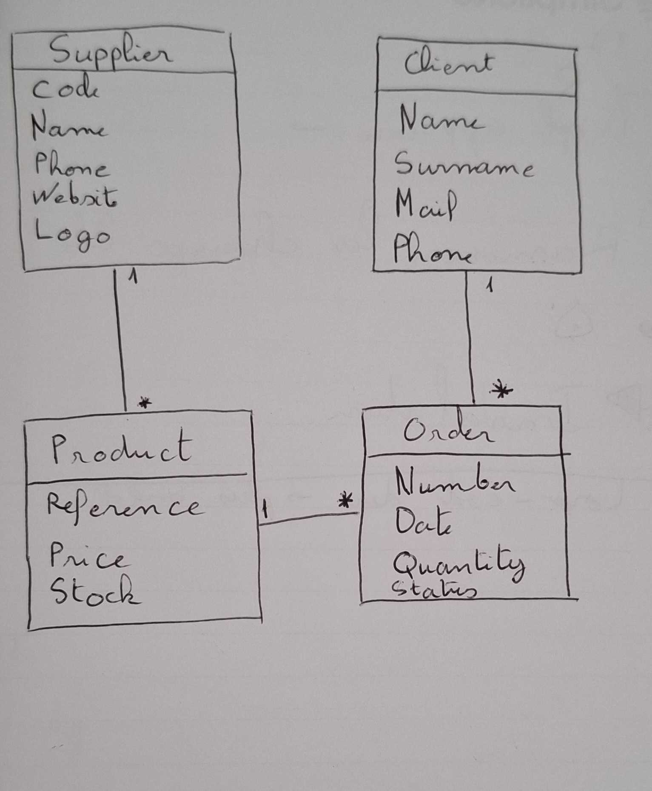
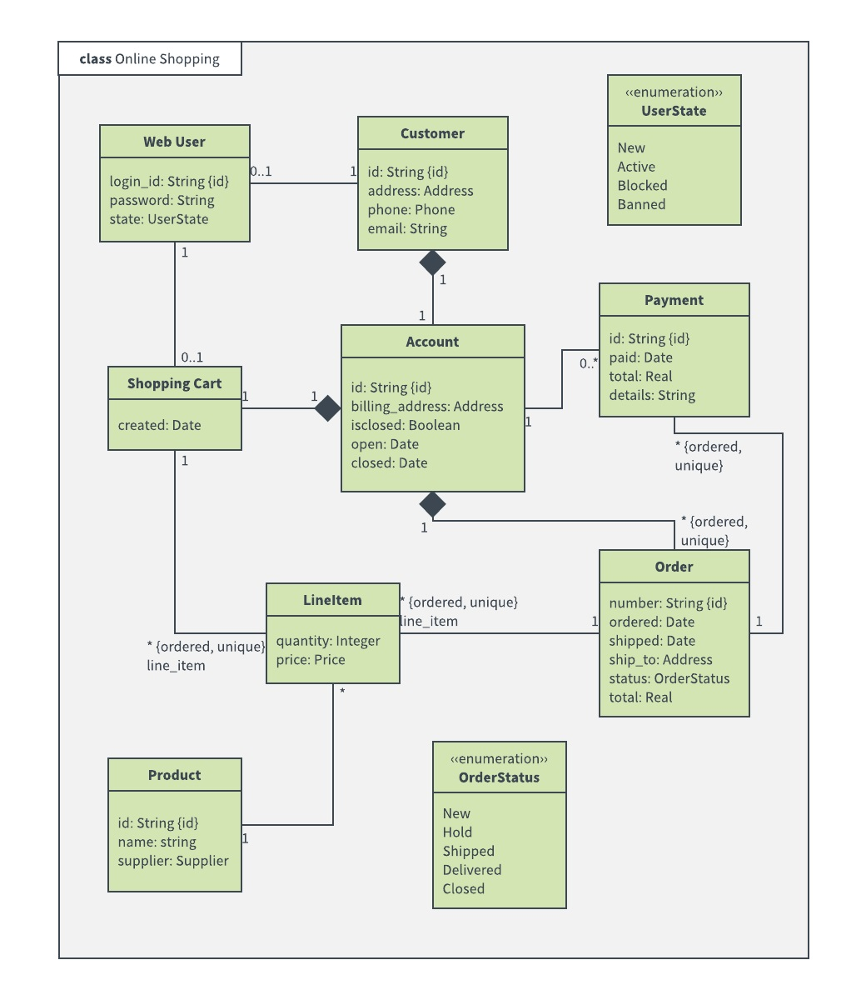

# Introduction

This document provides various prompt examples for the different available AI assistants.

---

## Module Generation

Use AI to co-create or update a module based on your business needs. This feature is available in the **AI assistant** domain.

<details>
  <summary>Scenario 1: Hand-Drawn UML of the Training Module</summary>
  
  
  
  This example shows a hand-drawn UML diagram representing a training module. It includes basic elements such as classes and relationships.

</details>

<details>
  <summary>Scenario 2: Complex UML for an Order Management Application</summary>
  
  
  
  This UML diagram illustrates a more complex application, specifically an order management system.

</details>

<details>
  <summary>Scenario 3: Detailed Business Prompt </summary>  

  Develop a module for a library management system to streamline book and patron management. The module should be object-oriented and include:

  1. **Book Management**: Track book details, including titles, authors, genres, and availability.
  2. **Patron Management**: Manage patron information, including contact details and borrowing history.
  3. **Check-Out/Check-In**: Facilitate the check-out and check-in process for books.
  4. **Reservation System**: Allow patrons to reserve books and view their current reservations.
  5. **Reporting**: Generate basic reports on book inventory, overdue items, and patron activity.

</details>

<details>
  <summary>Scenario 4: Adding a Cart Class to the Existing Training Module</summary>
  
  Use the module from Scenario 1 as the base. You will automatically retrieve the existing module's details. Request the addition of a new class called `Cart` with the following attributes:

  **Prompt:**

```
  Please add a `Cart`. The `Cart` class should have:

  - **Attributes**:
    - `cartID` (String)
    - `creationDate` (Date)
    - `items` (List of Item)
```

</details>

---

## Data Generation

Use AI to generate test data for a module. This feature is also available in the **AI assistant** domain.

---

## Business Chatbot

A shortcut to a chatbot contextualized according to the form on which it is opened. The user must have `AI_BUSINESS` rights. The `Personal data`, `Confidential data`, and `Intimate` fields are not sent to the AI.

### On Demo objects: 

<details>
  <summary>Example 1: Supplier</summary>
  
  **Prompt:**

  `Could you provide me with an invitation email for our upcoming product presentation event?`
  
  **Explanation:**  
  
  This prompt requests the chatbot to generate an invitation email for an event, contextualized to a supplier.

</details>

<details>
  <summary>Example 2: Supplier</summary>

  **Prompt:**

  `Quelle est l'adresse de ce fournisseur ?`

  **Explanation:**

  This prompt requests the chatbot to provide the address of a particular supplier.
</details>

<details>
  <summary>Example 3: Product</summary>
  
  **Prompt:**

  `Could you draft a stock order email to the supplier?`
  
  **Explanation:**  
  
  This prompt asks the chatbot to create a formal email for ordering stock from a supplier. 

</details>

<details>
  <summary>Example 4: Product</summary>

  **Prompt:**

  `Résumé moi la description de ce produit.`

  **Explanation:**

  This prompt asks the chatbot to provide a summary of the product description.
</details>

<details>
  <summary>Example 5: Product</summary>

  **Prompt:**

  `Quelle promotion pourrait être pertinente à mettre en place sur ce produit ?`

  **Explanation:**

  This prompt asks the chatbot to suggest relevant promotions that could be applied to a specific product.
</details>

<details>
  <summary>Example 6: Customers</summary>
  
  **Prompt:**

  `Can you help me draft an email informing a customer of a special promo code for their loyalty?`
  
  **Explanation:**  
  
  This prompt asks the chatbot to create an email that informs a customer about a special promo code they can use as a reward for their loyalty.

</details>

<details>
  <summary>Example 7: Order</summary>
  
  **Prompt:**

  `Could you generate an order confirmation email for a recent purchase?`
  
  **Explanation:**  
  
  This prompt requests the chatbot to draft an order confirmation email for a purchase. 

</details>

<details>
  <summary>Example 8: Order</summary>
  
  **Prompt:**

  `Can you provide a summary of this order?`
  
  **Explanation:**  
  
  This prompt asks the chatbot to give a brief overview of the details related to a specific order.
</details>

<details>
  <summary>Example 9: Order</summary>

  **Prompt:**

  `Que peux-tu me dire du produit de cette commande ?`

  **Explanation:**

  This prompt requests the chatbot to provide details or information about the product associated with a specific order.
</details>

---

## Metrics

Generate AI graphs on a module's data. In a `view`, add an `external page` with source `External object`: `AIMetricsChat?module=<your_module_name>`


## Metrics

Generate AI graphs on a module's data. In a `view`, add an `external page` with source `External object`: `AIMetricsChat?module=<your_module_name>`


### With Demo AI Addon in AI Assistant in Demo domain:

<details>
  <summary>Example 1: Monthly Orders Overview</summary>
  
  **Prompt:**

  `Generate a graph showing the total number of orders placed each month for the past year.`

  **Summary:**

  This prompt requests a monthly breakdown of the total number of orders placed over the past year to track trends and seasonal variations.

</details>

<details>
  <summary>Example 2: Top Products Stock Levels</summary>
  
  **Prompt:**

  `Create a graph showing the current stock levels of products.`

  **Summary:**

  This prompt asks for a graph illustrating the stock levels of products, focusing on the current inventory quantities.

</details>


<details>
  <summary>Example 3: Supplier Product Distribution</summary>
  
  **Prompt:**

  `Generate a pie chart showing the percentage of products provided by each supplier.`

  **Summary:**

  This prompt requests a pie chart that shows the distribution of products across different suppliers, highlighting each supplier's contribution to the total product inventory.

</details>

<details>
  <summary>Example 4: Order Status Distribution</summary>
  
  **Prompt:**

  `Create a graph showing the distribution of order statuses (e.g., Completed, Pending, Shipped) for the current quarter. Include the count of orders for each status.`

  **Summary:**

  This prompt asks for a graph that displays the number of orders for each status (Completed, Pending, Shipped) for the current quarter, providing insight into the current order processing state.

</details>
<details>
  <summary>Example 5: Number of Orders per Product</summary>
  
  **Prompt:**

  `Crée un graphique à barres montrant le nombre total de commandes pour chaque produit.`

  **Summary:**

  This request asks for a bar chart illustrating the total number of orders placed for each product, providing an overview of the popularity of different products.

</details>

<details>
  <summary>Example 6: Sales per Product</summary>
  
  **Prompt:**

  `Montre-moi un graphique des ventes pour chaque produit.`

  **Summary:**

  This request asks for a chart showing the sales for each product, allowing visualization of the performance of different products in terms of sales.

</details>

<details>
  <summary>Example 7: Monthly Sales</summary>
  
  **Prompt:**

  `Affiche les ventes totales par mois pour cette année.`

  **Summary:**

  This request asks for a chart of the total sales per month for the current year, providing an overview of the monthly sales trends.

</details>

<details>
  <summary>Example 8: Customer Distribution by Country</summary>
  
  **Prompt:**

  `Quels sont les pays où nous avons le plus de clients ?`

  **Summary:**

  This request asks for a chart showing the distribution of customers by country, highlighting the countries with the highest number of customers.

</details>

<details>
  <summary>Example 9: Order Status</summary>
  
  **Prompt:**

  `Quel est le statut de nos commandes ?`

  **Summary:**

  This request asks for a chart showing the current status of orders (e.g., Completed, Pending, Shipped), providing an overview of the current state of orders.

</details>

<details>
  <summary>Example 10: Products in Stock</summary>
  
  **Prompt:**

  `Quels produits avons-nous en stock et en quelles quantités ?`

  **Summary:**

  This request asks for a chart illustrating the products currently in stock and their quantities, allowing for effective inventory management.

</details>

<details>
  <summary>Example 11: Products by Supplier</summary>
  
  **Prompt:**

  `Quels produits proviennent de chaque fournisseur ?`

  **Summary:**

  This request asks for a chart showing the products provided by each supplier, highlighting each supplier's contribution to the total inventory.

</details>

<details>
  <summary>Example 12: Average Prices per Product</summary>
  
  **Prompt:**

  `Quel est le prix moyen de nos produits vendus par client ?`

  **Summary:**

  This request asks for a chart showing the average price of products sold per customer, providing insight into customers' spending habits.

</details>

<details>
  <summary>Example 13: Evolution of Orders per Customer</summary>
  
  **Prompt:**

  `Comment le nombre de commandes par client a-t-il évolué au fil du temps ?`

  **Summary:**

  This request asks for a chart illustrating the evolution of the number of orders per customer over time, allowing for tracking of individual customer purchasing trends.

</details>


---
